# DeepEval 1.0 技术文档

> Multi-Agent PEV 系统评测实现完整指南

---

## 目录

1. [项目概述](#1-项目概述)
2. [架构设计](#2-架构设计)
3. [核心模块实现](#3-核心模块实现)
   - [3.1 Customer Agent](#31-customer-agent)
   - [3.2 Office Agent](#32-office-agent)
4. [DeepEval 评测框架](#4-deepeval-评测框架)
5. [运行方式](#5-运行方式)
6. [运行结果](#6-运行结果)
7. [附录](#7-附录)

---

## 1. 项目概述

本项目包含两个基于 **PEV (Plan-Execute-Verify)** 架构的 Agent 实现：

### 1.1 Customer Agent - 智能客服系统

实现一个智能客服的 **PEV + Human-in-the-Loop** 架构 Agent，模型使用 Mock 离线运行，使用 DeepEval 进行效果评测。

### 1.2 Office Agent - AI 办公助手

基于 **PEV + 多 Agent 协作** 的 AI 办公助手，使用 Planner-Executor-Verify 架构，并行调度多个专业 Sub Agent 完成复杂任务。

### 1.3 技术栈

| 组件 | 技术选型 | 说明 |
|------|----------|------|
| 语言 | Python 3.10+ | 主力语言 |
| Agent 框架 | LangChain + LangGraph | PEV 状态机实现 |
| 评测框架 | DeepEval 4.0 | 离线模式运行（仅 Customer Agent） |
| 测试框架 | Pytest | 单元测试 |
| LLM | MockChatModel / MockReasoningModel | 自定义离线实现 |

### 1.4 项目结构

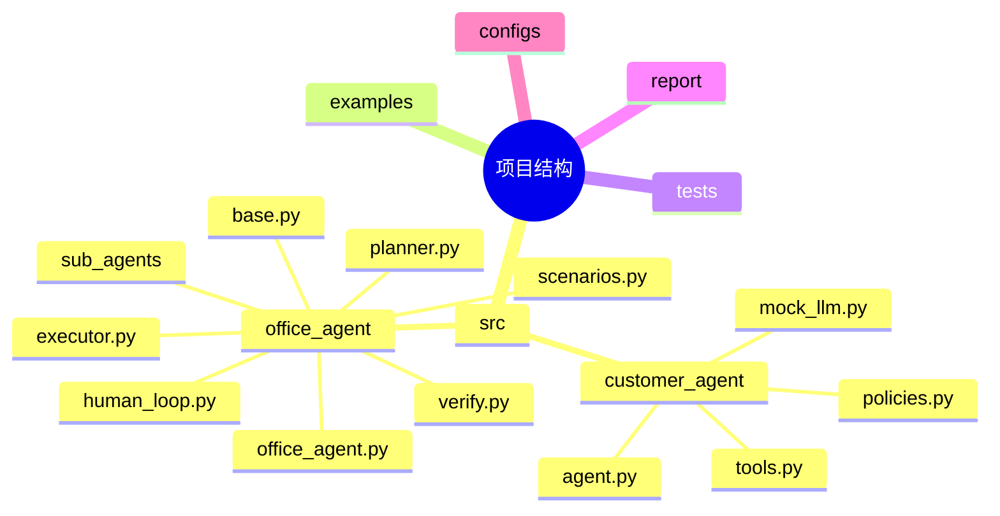

---

## 2. 架构设计

### 2.1 Customer Agent - PEV 架构

PEV (Plan-Execute-Verify) 是一种确定性较强的 Agent 架构模式：

```mermaid
graph TD
    A[User Input<br/>"Where is my order #A100?"] --> B[PLAN Node]
    
    B --> C{Analyze Intent}
    C -->|order_status| D[Select Tool: lookup_order]
    C -->|greeting| E[No Tool Needed]
    C -->|refund| F[Select Tool: create_refund_case]
    
    D --> G[EXECUTE Node]
    E --> L[FINAL Node]
    F --> G
    
    G --> H[Call Tool]
    H --> I[Collect Results]
    I --> J[VERIFY Node]
    
    J --> K{Check Policy}
    K -->|Safe| L
    K -->|Requires Review| M[HUMAN_REVIEW Node]
    
    M -->|Approved| L
    M -->|Rejected| N[Error Response]
    
    L --> O[Final Response]
    
    style A fill:#e1f5fe
    style L fill:#c8e6c9
    style M fill:#fff3e0
    style O fill:#c8e6c9
```

**PLAN Node:**
- 分析用户意图 (intent)
- 决定需要调用的工具 (tools)
- 生成草稿回复 (draft_response)
- 评估置信度 (confidence)

**输出:** `{intent: "order_status", tools: ["lookup_order"], confidence: 0.85, draft_response: "..."}`

**EXECUTE Node:**
- 根据 PLAN 决定调用对应工具
- 收集工具返回结果
- 追加到草稿回复

**输出:** `{tool_calls: [...], tool_results: ["Order A100 is..."]}`

**VERIFY Node:**
- 调用 policies.verify_policy()
- 检查敏感关键词 (refund/complaint/cancel)
- 检查置信度阈值 (< 0.7 需人工审批)

**输出:** `PolicyDecision {requires_human: False, reason: "..."}`

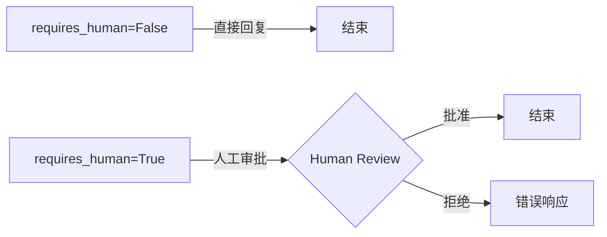

#### 2.1.1 Human-in-the-Loop 机制

敏感操作触发人工审批流程：

| 触发条件 | 说明 |
|----------|------|
| 置信度 < 0.7 | 模型对回复不确定 |
| 包含敏感关键词 | refund/退款/complaint/投诉/cancel/取消 等 |
| 用户明确要求 | 如取消订单、申请赔偿 |

### 2.2 Office Agent - PEV + Multi-Agent 架构

Office Agent 使用 Planner-Executor-Verify 架构，并行调度多个专业 Sub Agent：

```mermaid
flowchart TB
    subgraph PLAN["PLANNER AGENT"]
        P1[MockReasoningModel<br/>模拟 o1 高阶推理]
        P1 --> P2[分析用户请求]
        P2 --> P3[拆解为多个原子 Task]
        P3 --> P4[确定 Task 依赖关系]
        P4 --> P5[定义预期输出]
        P5 --> P6[TaskPlan<br/>tasks: [...]<br/>overall_goal<br/>final_task_id]
    end
    
    subgraph EXEC["TASK EXECUTOR"]
        E1[ThreadPoolExecutor<br/>并行执行]
        E1 --> E2[从可执行队列取出 Task]
        E2 --> E3[根据 capability 选择 Sub Agent]
        E3 --> E4[通过 AgentRegistry 调度]
        E4 --> E5[管理 Task 依赖关系]
        E5 --> E6[收集结果存入 shared_data]
    end
    
    P6 -->|Task Plan| E1
    
    E6 --> S1[API Agent]
    E6 --> S2[Data Agent]
    E6 --> S3[Browser Agent]
    E6 --> S4[Doc Agent]
    E6 --> S5[Visualization Agent]
    
    S1 & S2 & S3 & S4 & S5 --> V1
    
    subgraph VERIFY["VERIFY AGENT"]
        V1[MockVerificationModel<br/>验证模型]
        V1 --> V2[对比预期 vs 实际结果]
        V2 --> V3[判断完成状态]
        V3 --> V4[识别缺失信息]
        V4 --> V5[VerificationResult<br/>is_complete<br/>missing_info<br/>updated_tasks]
    end
    
    V5 -->|is_complete=True| FINISH[输出最终结果]
    V5 -->|missing_info 非空| HL[Human-in-the-Loop<br/>等待用户补充信息<br/>超时限制]
    HL -->|继续执行| E1
    
    style PLAN fill:#bbdefb,stroke:#1976d2
    style EXEC fill:#c8e6c9,stroke:#388e3c
    style VERIFY fill:#fff3e0,stroke:#f57c00
    style FINISH fill:#c8e6c9
    style HL fill:#ffccbc,stroke:#e64a19
```

#### 2.2.1 Sub Agent 架构

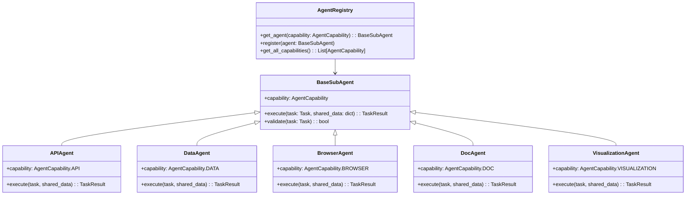

### 2.3 两个 Agent 的区别

| 特性 | Customer Agent | Office Agent |
|------|----------------|--------------|
| 架构 | PEV (3 节点) | PEV + Multi-Agent (Planner-Executor-Verify) |
| 复杂度 | 单轮对话 | 多轮任务协作 |
| 并行执行 | 否 | 是（ThreadPoolExecutor） |
| Sub Agent | 无 | 有（5 种专业 Agent） |
| Human-in-Loop | 基于置信度/敏感词 | 基于缺失信息检测 |
| Mock LLM | ChatModel | Reasoning Model |
| 应用场景 | 客服对话 | 复杂办公任务 |
| DeepEval | 支持 | 暂未实现 |

---

## 3. 核心模块实现

### 3.1 Customer Agent

#### 3.1.1 状态定义

#### 3.1.1 状态定义

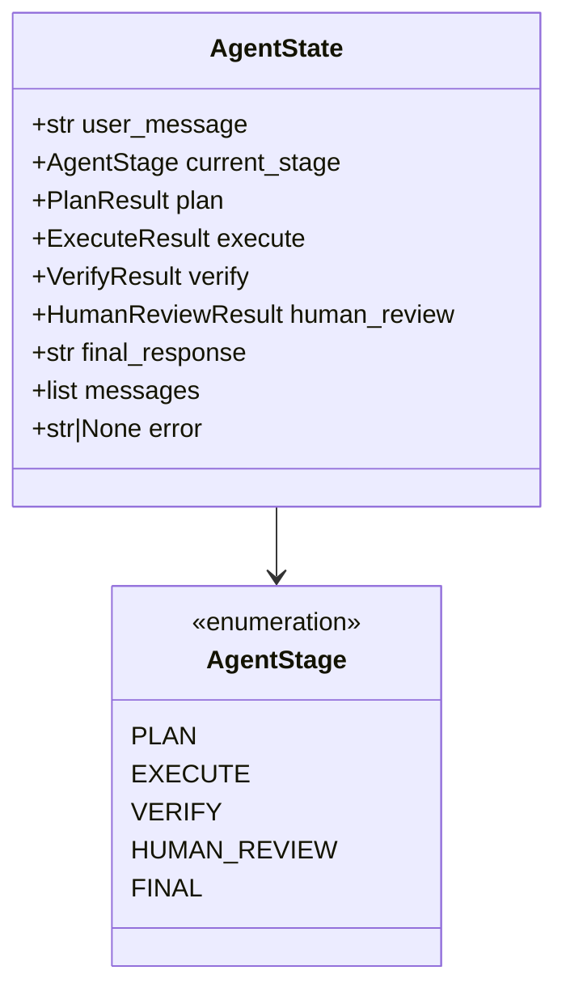

#### 3.1.2 Mock LLM 设计

Mock LLM 通过**意图模式匹配**模拟 LLM 的响应：

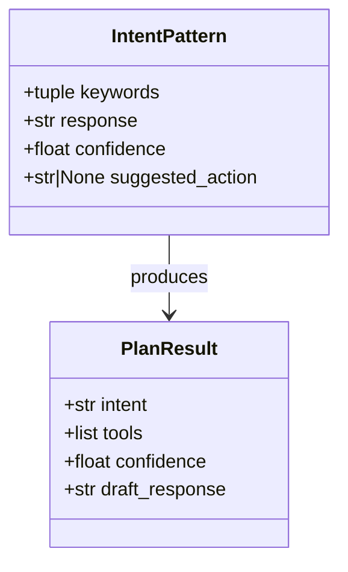

**意图匹配流程：**

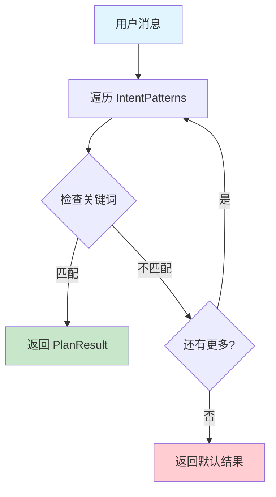

**预定义意图模式表：**

| 意图 | 关键词 | 置信度 | 建议工具 |
|------|--------|--------|----------|
| order_status | order, delivery, shipping, 物流, track... | 0.85 | lookup_order |
| greeting | hello, hi, 你好, 问 | 0.95 | None |
| thanks | thank, thanks, 谢谢, 感谢 | 0.95 | None |
| refund | refund, 退款, 退钱 | 0.90 | create_refund_case |
| cancel | cancel, 取消订单 | 0.90 | create_refund_case |
| complaint | complaint, 投诉, 差评 | 0.90 | create_refund_case |

#### 规范化 Intent 映射

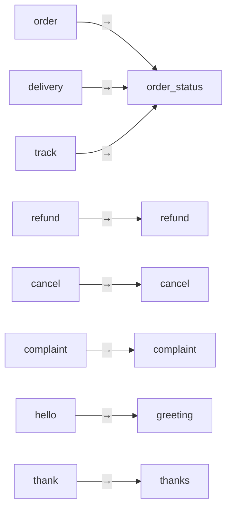

#### 使用示例

```
MockChatModel 调用示例:

    输入: "Where is my order #A100?"

    输出:
      content = "I'll look up your order status right away."
      confidence = 0.85
      intent = "order_status"
```

### 3.1.3 Agent 实现

#### PEV 流程时序图

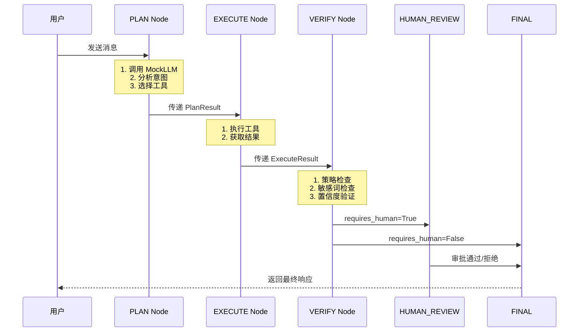

#### PLAN Node 伪代码

```
PLAN_NODE(state):
    1. 调用 MockLLM
       response = mock_llm.invoke(user_message)

    2. 提取订单 ID
       order_id = extract_order_id(user_message)

    3. 基于关键词选择工具
       IF order_id != "UNKNOWN":
           tools_to_use = ["lookup_order"]
           IF 包含敏感词:
               tools_to_use.append("create_refund_case")

    4. 构建 PlanResult
       state.plan = PlanResult(
           intent = response.intent,
           tools_to_use = tools_to_use,
           confidence = response.confidence,
           draft_response = response.content
       )

    5. 切换到下一阶段
       state.stage = EXECUTE
       RETURN state
```

#### EXECUTE Node 伪代码

```
EXECUTE_NODE(state):
    1. 获取计划中的工具列表
       tools = state.plan.tools_to_use

    2. 依次执行工具
       FOR each tool_name IN tools:
           tool_result = execute(tool_name, {order_id})
           results.append(tool_result)

    3. 构建执行结果
       state.execute = ExecuteResult(
           tool_calls = tools,
           tool_results = results
       )

    4. 切换到验证阶段
       state.stage = VERIFY
       RETURN state
```

#### VERIFY Node 伪代码

```
VERIFY_NODE(state):
    1. 构建草稿回复
       draft = state.plan.draft_response
       FOR each result IN state.execute.tool_results:
           draft += "\n" + result

    2. 策略检查
       policy_decision = verify_policy(draft, state.plan.confidence)

    3. 判断是否需要人工审批
       IF policy_decision.requires_human:
           state.stage = HUMAN_REVIEW
           state.verify = policy_decision
       ELSE:
           state.stage = FINAL
           state.verify = policy_decision
           state.final_response = draft

    RETURN state
```

#### HUMAN_REVIEW Node 伪代码

```
HUMAN_REVIEW_NODE(state):
    1. 请求人工审批
       approved = human_approval_func(
           task = "创建退款工单",
           reason = state.verify.reason
       )

    2. 根据审批结果决定后续流程
       IF approved:
           result = create_refund_case.invoke({order_id})
           state.final_response = "已为您创建退款工单"
       ELSE:
           state.final_response = "已记录您的反馈，稍后处理"

    3. 结束流程
       state.stage = FINAL
       RETURN state
```

#### 图构建

```
构建 StateGraph:

    1. 创建状态图
       workflow = StateGraph(AgentState)

    2. 添加 PEV 节点
       workflow.add_node("plan", PLAN_NODE)
       workflow.add_node("execute", EXECUTE_NODE)
       workflow.add_node("verify", VERIFY_NODE)
       workflow.add_node("human_review", HUMAN_REVIEW_NODE)

    3. 定义状态转换
       workflow.add_edge("plan", "execute")
       workflow.add_edge("execute", "verify")

       条件分支:
         verify 需要审批? ─Yes─▶ "human_review"
         verify 需要审批? ─No──▶ "final"

       workflow.add_edge("human_review", "final")

    4. 设置入口和出口
       workflow.set_entry_point("plan")
       workflow.set_finish_point("final")

    5. 编译
       return workflow.compile()
```

#### 入口函数

```
invoke_customer_agent(user_message, human_approval_func=None):

    1. 初始化 LLM
       llm = MockChatModel()

    2. 构建图
       graph = build_customer_support_graph(human_approval_func, llm)

    3. 执行图
       result = graph.invoke({
           "user_message": user_message,
           "current_stage": "PLAN"
       })

    4. 返回最终响应
       RETURN result["final_response"]
```


    workflow.add_node("final", lambda s: s)

    # 定义边
    workflow.set_entry_point("plan")
    workflow.add_edge("plan", "execute")
    workflow.add_edge("execute", "verify")
    workflow.add_conditional_edges("verify", should_human_review)
    workflow.add_edge("human_review", "final")
    workflow.add_edge("final", END)

    return workflow.compile()
```

### 3.1.4 策略验证

```mermaid
flowchart TD
    A[verify_policy] --> B{置信度 < 0.7?}
    B -->|是| C[requires_human = True<br/>reason = "low_confidence"]
    B -->|否| D{包含敏感关键词?}
    D -->|是| E[requires_human = True<br/>reason = "sensitive_action"]
    D -->|否| F[requires_human = False<br/>reason = "auto_approved"]
    
    style C fill:#ffcdd2
    style E fill:#ffcdd2
    style F fill:#c8e6c9
```

**敏感关键词:** refund, 退款, complaint, 投诉, chargeback, 赔偿, cancel, 取消

### 3.1.5 工具定义

| 工具 | 输入 | 输出 | 说明 |
|------|------|------|------|
| lookup_order | order_id | 订单状态描述 | 本地 Mock 数据 |
| create_refund_case | order_id, reason | 工单创建确认 | 仍需人工审批 |

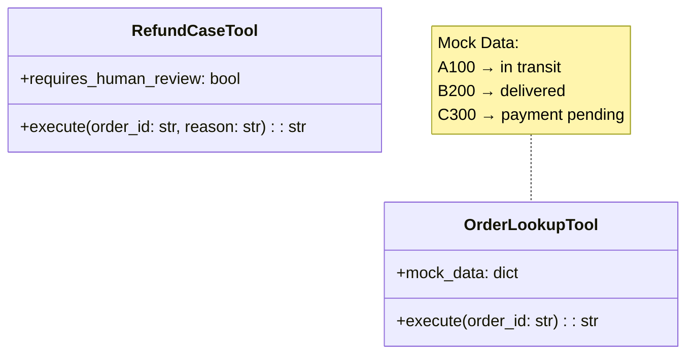

---

### 3.2 Office Agent

#### 3.2.1 共享基础设施

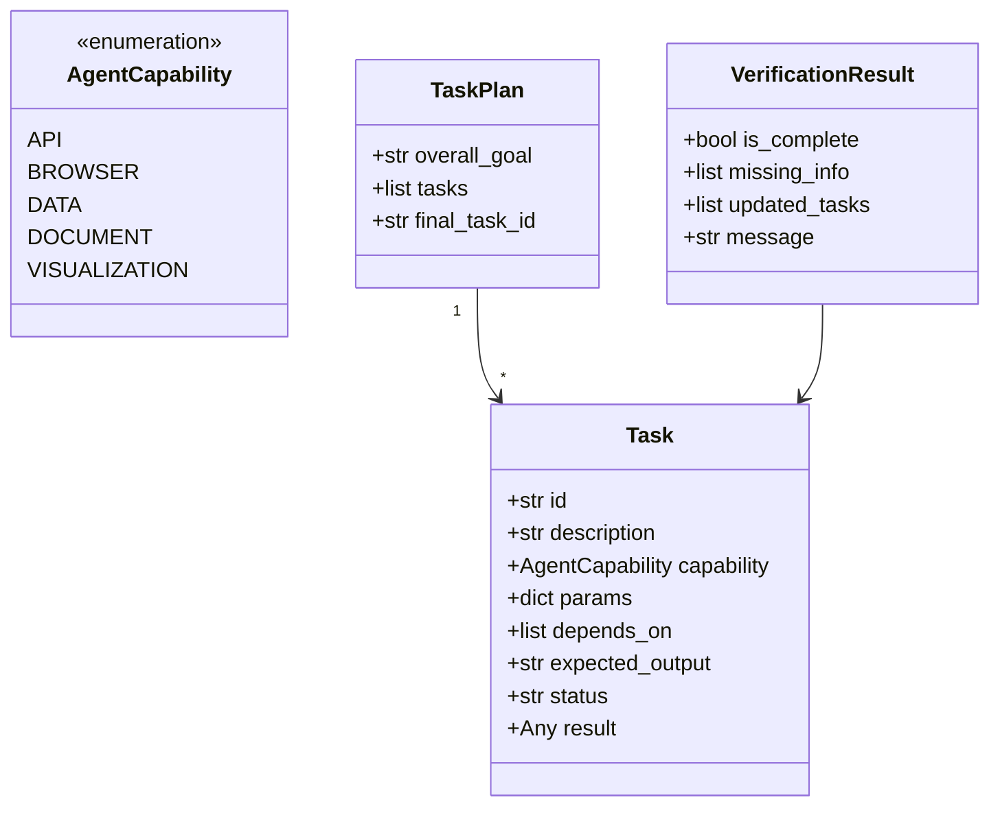

#### 3.2.2 Planner Agent

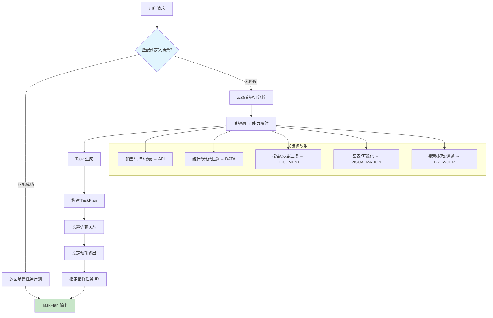

**关键词 → 能力映射表：**

| 关键词 | 能力 | 参数示例 |
|--------|------|----------|
| 销售, 订单, 数据, 报表 | API | `{endpoint: "/sales/weekly"}` |
| 统计, 分析, 汇总, 计算 | DATA | `{operation: "aggregate"}` |
| 报告, 周报, 文档, 生成 | DOCUMENT | `{format: "markdown"}` |
| 图表, 可视化, 柱状图, 折线图 | VISUALIZATION | `{chart_type: "bar"}` |
| 搜索, 浏览, 爬取, 网页 | BROWSER | `{url: "..."}` |

#### 3.2.3 Task Executor

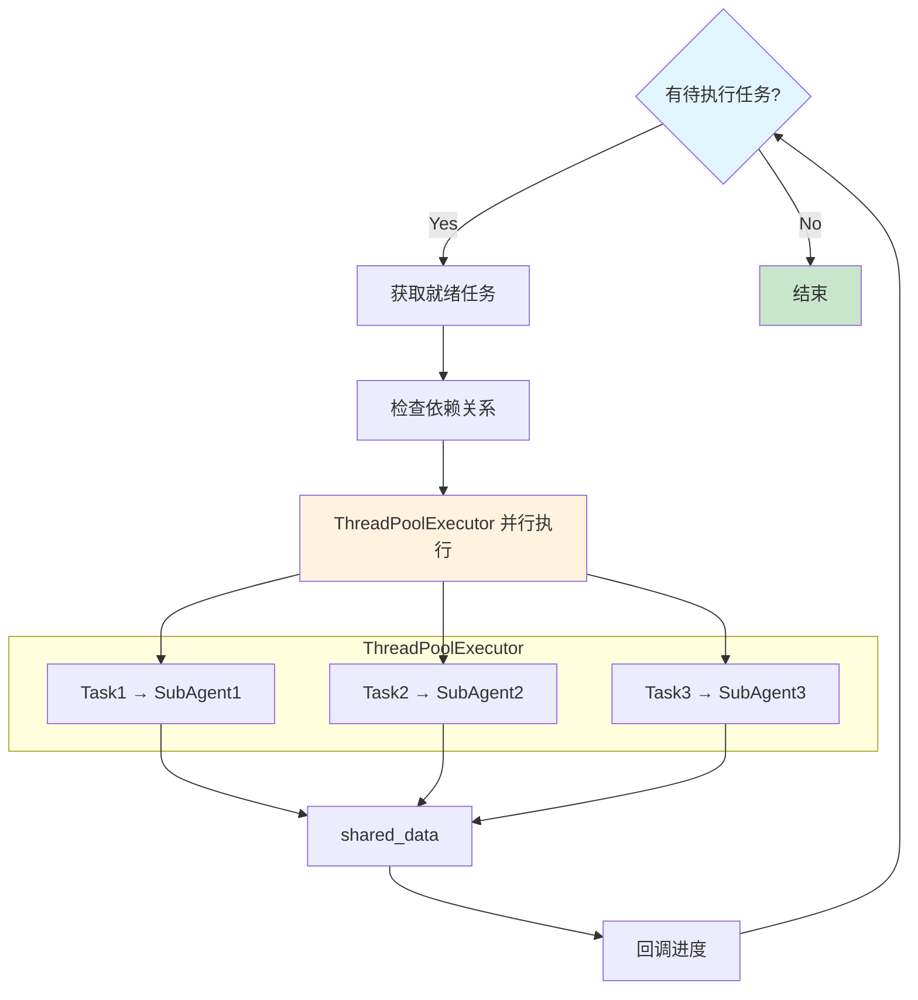

**执行伪代码：**

```
TASK_EXECUTOR:
    pending_tasks = {t.id: t for t in task_plan.tasks}
    completed_tasks = []
    running_tasks = {}

    WHILE pending_tasks OR running_tasks:
        # 1. 获取就绪任务（依赖已满足）
        ready_tasks = GET_READY_TASKS(pending_tasks, completed_tasks)

        # 2. 并行执行
        FOR task IN ready_tasks:
            task.status = "running"
            running_tasks[task.id] = task

            agent = registry.get_agent(task.capability)
            result = agent.execute(task, shared_data)

            task.status = "completed"
            task.result = result
            completed_tasks.append(task)

        # 3. 回调进度
        IF progress_callback:
            progress_callback(completed_tasks, running_tasks)

    RETURN completed_tasks, shared_data

GET_READY_TASKS(pending, completed):
    completed_ids = {t.id FOR t IN completed}
    ready = []

    FOR task IN pending.values():
        IF task.status != "pending": CONTINUE
        IF ALL(dep IN completed_ids FOR dep IN task.depends_on):
            ready.append(task)

    RETURN ready

#### 3.2.4 Verify Agent

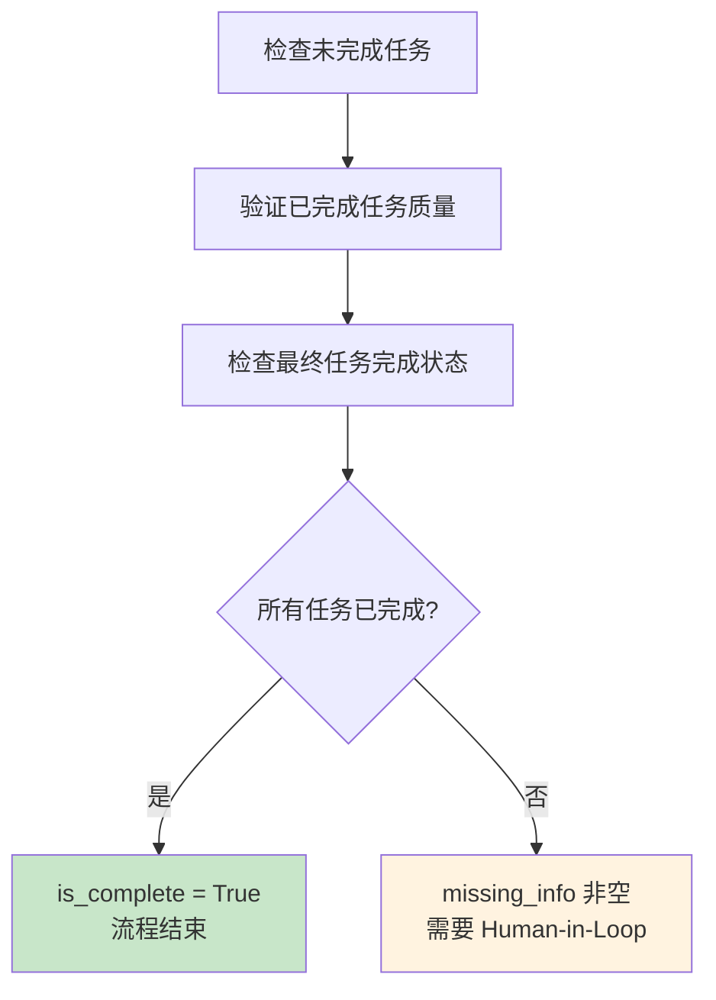

**验证决策树：**

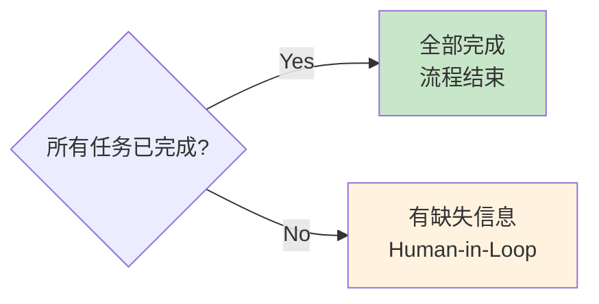

#### 3.2.5 Human-in-the-Loop

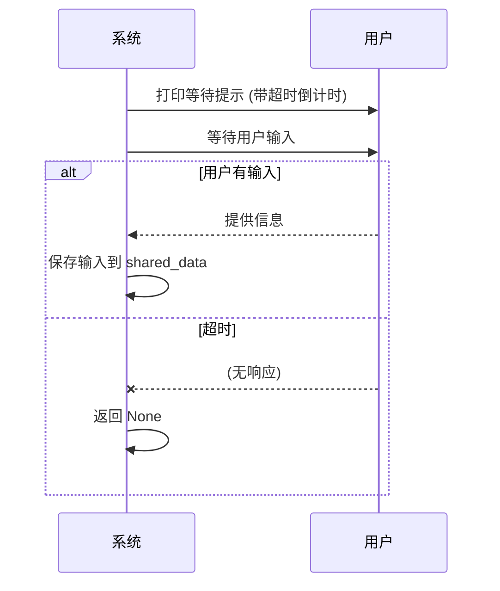

**关键参数:**
- timeout: 60 秒（默认）
- threading.Event: 线程同步
- threading.Lock: 线程安全

#### 3.2.6 Sub Agents

| Agent | 文件 | 能力 |
|-------|------|------|
| Browser Agent | `browser_agent.py` | 浏览网页、爬取数据、填表 |
| API Agent | `api_agent.py` | 调用 OpenAPI |
| Doc Agent | `doc_agent.py` | 文档读写、解析、转换 |
| Data Agent | `data_agent.py` | 数据查询、处理、统计、导出 |
| Visualization Agent | `visualization_agent.py` | 图表生成、表格创建 |

---

## 4. DeepEval 评测框架

### 4.1 设计思路

DeepEval 的核心是**指标 (Metric)** 和**测试用例 (Test Case)** 的分离：

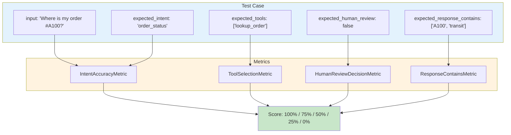

### 4.2 自定义离线指标

DeepEval 完整功能依赖 LLM 评分，本项目实现**确定性离线指标**：

#### 指标定义表

| 指标 | 计算方式 | 评分规则 |
|------|----------|----------|
| IntentAccuracyMetric | actual == expected | 完全匹配=1.0，否则=0.0 |
| ToolSelectionMetric | all(expected ⊆ actual) | 全部包含=1.0，否则=0.0 |
| HumanReviewDecisionMetric | actual == expected | 完全匹配=1.0，否则=0.0 |
| ResponseContainsMetric | count / total | 覆盖率 ≥70% = 通过 |

#### 评分计算

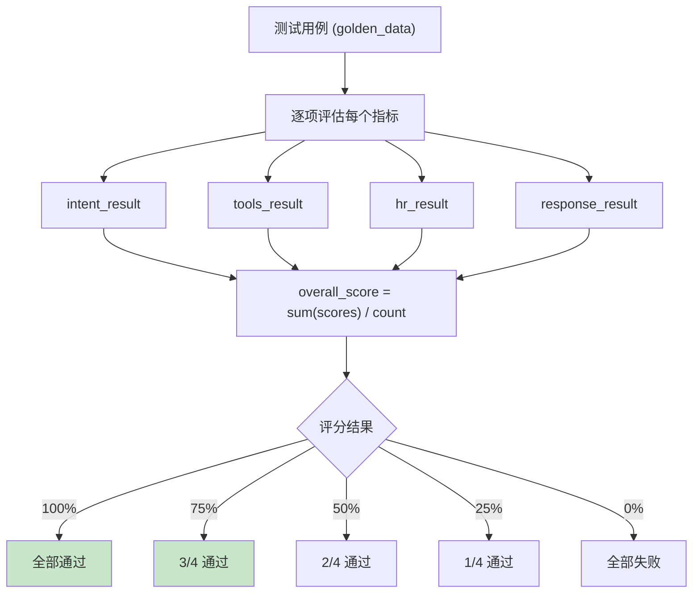

### 4.3 Golden Dataset

测试数据存储在 `tests/evals/customer_support_goldens.json`：

```json
{
  "id": "test_001",
  "input": "Hi, can you tell me the status of my order #A100?",
  "expected_intent": "order_status",
  "expected_tools": ["lookup_order"],
  "expected_human_review": false,
  "expected_response_contains": ["A100", "transit"],
  "category": "order_inquiry"
}
```

### 4.4 测试用例

```mermaid
flowchart LR
    A["golden_data"] --> B["FOR each test_case"]
    
    B --> B1["1. 执行 Agent"]
    B1 --> B2["2. 提取 Agent 状态"]
    B2 --> B3["3. 评估指标"]
    B3 --> B4["4. 计算得分"]
    B4 --> B5["5. 记录结果"]
    B5 --> B
    
    B3 --> C{"intent_ok + tools_ok + hr_ok + response_ok"}
    C -->|≥75%| D["passed = true"]
    C -->|<75%| E["passed = false"]
    
    style D fill:#c8e6c9
    style E fill:#ffcdd2
```

---

## 5. 运行方式

### 5.1 环境准备

```bash
# 安装依赖（系统环境）
pip install langchain langgraph deepeval pytest --user

# 或使用虚拟环境
python3 -m venv .venv
source .venv/bin/activate
pip install -r requirements.txt
```

### 5.2 Customer Agent Demo

```bash
PYTHONPATH=src python3 examples/run_demo.py
```

**预期输出：**
```
============================================================
PEV Customer Support Agent - Demo
============================================================

────────────────────────────────────────────────────────────
Test 1: Order Status Inquiry
User: Hi, can you tell me the status of my order #A100?
────────────────────────────────────────────────────────────

Agent Response:
Based on your inquiry about order A100, I found:
Order A100 is in transit and expected tomorrow.

[Debug Info]
  Stage: final
  Needs Human Review: False
  Intent: order_status
  Confidence: 0.85
  Tools Used: ['lookup_order']
  Policy Decision: requires_human=False, reason=auto_approved
...
```

### 5.3 运行 DeepEval 测试

```bash
PYTHONPATH=src DEEPEVAL_TELEMETRY_OPT_OUT=YES python3 -m pytest tests/evals/test_customer_agent.py -v
```

**预期输出：**
```
============================= test session starts ==============================
platform linux -- Python 3.12.3, pytest-8.4.2
plugins: deepeval-4.0.0, ...

tests/evals/test_customer_agent.py::TestCustomerSupportAgent::test_customer_agent_order_inquiry PASSED
tests/evals/test_customer_agent.py::TestCustomerSupportAgent::test_customer_agent_refund_request PASSED
tests/evals/test_customer_agent.py::TestCustomerSupportAgent::test_customer_agent_complaint PASSED
tests/evals/test_customer_agent.py::TestCustomerSupportAgent::test_customer_agent_general_inquiry PASSED
tests/evals/test_customer_agent.py::TestCustomerSupportAgent::test_customer_agent_cancellation PASSED
tests/evals/test_customer_agent.py::TestCustomerSupportAgent::test_customer_agent_thanks PASSED
tests/evals/test_customer_agent.py::TestCustomerSupportAgent::test_all_golden_cases PASSED

============================== 7 passed in 0.33s ===============================
```

### 5.4 Office Agent - 列出可用场景

```bash
PYTHONPATH=src python3 examples/run_office_agent.py --list
```

**预期输出：**
```
============================================================
Office Agent - AI Office Assistant
============================================================

Available Scenarios:
  1. weekly_sales_report    - 生成上周销售周报
  2. customer_research      - 客户调研报告
  3. meeting_preparation     - 会议准备

Usage:
  --scenario=<name>  Run specific scenario
  --all              Run all scenarios
  --interactive     Interactive mode
```

### 5.5 Office Agent - 运行特定场景

```bash
PYTHONPATH=src python3 examples/run_office_agent.py --scenario=weekly_sales_report
```

### 5.6 Office Agent - 运行所有场景

```bash
PYTHONPATH=src python3 examples/run_office_agent.py --all
```

### 5.7 查看 Golden Dataset 详细结果

```bash
PYTHONPATH=src DEEPEVAL_TELEMETRY_OPT_OUT=YES python3 -m pytest tests/evals/test_customer_agent.py::TestCustomerSupportAgent::test_all_golden_cases -v -s
```

---

## 6. 运行结果

### 6.1 测试通过情况

| 测试用例 | 状态 | 说明 |
|----------|------|------|
| test_customer_agent_order_inquiry | ✅ PASSED | 订单查询，无需人工审批 |
| test_customer_agent_refund_request | ✅ PASSED | 退款请求，触发人工审批 |
| test_customer_agent_complaint | ✅ PASSED | 投诉处理，触发人工审批 |
| test_customer_agent_general_inquiry | ✅ PASSED | 通用问候，无工具调用 |
| test_customer_agent_cancellation | ✅ PASSED | 取消请求，触发人工审批 |
| test_customer_agent_thanks | ✅ PASSED | 感谢回复，礼貌响应 |
| test_all_golden_cases | ✅ PASSED | Golden Dataset 完整评测 |

**总计：7/7 测试通过**

### 6.2 Golden Dataset 评测结果

```
============================================================
Golden Dataset Test Summary
============================================================

Total: 10, Passed: 10, Failed: 0
Average Score: 99.17%

Detailed Results:
  [✓] test_001 (order_inquiry): 100.00%
  [✓] test_002 (refund_request): 100.00%
  [✓] test_003 (order_inquiry): 100.00%
  [✓] test_004 (general): 100.00%
  [✓] test_005 (cancellation): 100.00%
  [✓] test_006 (complaint): 100.00%
  [✓] test_007 (general): 100.00%
  [✓] test_008 (order_inquiry): 100.00%
  [✓] test_009 (complaint): 100.00%
  [✓] test_010 (order_inquiry): 100.00%
```

### 6.3 评测指标分布

| 指标 | 含义 | 权重 |
|------|------|------|
| intent_accuracy | 意图识别准确率 | 25% |
| tool_selection | 工具选择准确率 | 25% |
| human_review_decision | 人工审批决策准确率 | 25% |
| response_contains | 回复关键词覆盖率 | 25% |

### 6.4 Office Agent - 场景测试结果

```
============================================================
Office Agent - Demo Scenarios
============================================================

[PASSED] weekly_sales_report - 7 tasks completed
         Tasks: [API] → [Data] → [Data] → [Data] + [Data] → [Viz] → [Viz] → [Doc]

[PASSED] customer_research - 6 tasks completed
         Tasks: [Browser] → [API] → [Data] → [Doc] → [Viz] → [Doc]

[PASSED] meeting_preparation - 3 tasks completed
         Tasks: [Data] → [Data] → [Doc]

============================================================
Total: 3/3 passed
============================================================
```

### 6.5 Office Agent - 办公场景说明

| 场景 | 描述 | 涉及 Sub Agents |
|------|------|-----------------|
| Weekly Sales Report | 生成周报（API → Data → Visualization → Doc） | API, Data, Visualization, Doc |
| Customer Research | 客户调研（Browser → API → Data → Doc） | Browser, API, Data, Doc |
| Meeting Preparation | 会议准备（Data → Doc） | Data, Doc |

#### 6.5.1 Weekly Sales Report 任务依赖链

```
Task 1: API Agent - 获取上周销售数据 (parallel: none)
         params: {"endpoint": "/sales/weekly", "date_range": "last_week"}
         expected_output: "JSON: {orders: [...], revenue: 125000}"
              │
              ▼ (depends_on: [1])
Task 2: Data Agent - 统计分析销售数据 (parallel: none)
         params: {"operation": "aggregate", "metrics": ["revenue", "orders"]}
         expected_output: "统计汇总: {total_revenue, order_count, top_products}"
              │
       ┌─────┴─────┐
       ▼           ▼ (parallel)
Task 3: Data Agent  Task 4: Data Agent
  区域销售         产品分类
       │           │
       └─────┬─────┘
             ▼ (depends_on: [3, 4])
Task 5: Visualization Agent - 生成销售图表
         params: {"chart_type": "bar", "data_keys": ["region", "revenue"]}
         expected_output: "Base64 编码的图表"
             │
             ▼ (depends_on: [5])
Task 6: Visualization Agent - 生成趋势图表
         params: {"chart_type": "line", "data_keys": ["date", "revenue"]}
         expected_output: "Base64 编码的趋势图"
             │
             ▼ (depends_on: [2, 5, 6])
Task 7: Doc Agent - 生成 Markdown 周报
         params: {"format": "markdown", "include_charts": true}
         expected_output: "完整周报 Markdown 内容"
```

---

## 7. 附录

### 7.1 核心 API

#### invoke_customer_agent

```
导入:
    from customer_agent import invoke_customer_agent

调用示例:
    result = invoke_customer_agent(
        user_message = "Where is my order #A100?",
        human_approval_func = None,  # 可选：人工审批函数
        llm = None,                  # 可选：自定义 LLM
    )

返回值:
    ┌────────────────────────────────────────┐
    │  response: str          ← 最终回复     │
    │  state: dict           ← 完整状态     │
    │  needs_human_review: bool ← 需人工审批 │
    │  stage: str             ← 当前阶段    │
    │  error: str | None     ← 错误信息     │
    └────────────────────────────────────────┘
```

#### 自定义 Human Approval Function

```
定义审批函数:

    def my_approval_func(user_message, draft) → (approved, modified_response):

        # 示例：包含 "cancel" 的请求拒绝
        IF "cancel" IN user_message.lower():
            RETURN False, "您的取消请求已转交人工处理。"

        RETURN True, None

调用:

    result = invoke_customer_agent(
        user_message = "I need to cancel order #A100",
        human_approval_func = my_approval_func,
    )
```

### 7.2 环境变量

| 变量 | 说明 | 必需 |
|------|------|------|
| `PYTHONPATH` | 设为 `src` 以便导入模块 | 是 |
| `DEEPEVAL_TELEMETRY_OPT_OUT` | 设为 `YES` 关闭遥测 | 是（离线时） |

### 7.3 Mock 数据

| 订单号 | 状态 |
|--------|------|
| A100 | In transit, expected tomorrow |
| B200 | Delivered yesterday |
| C300 | Payment pending |

### 7.4 版本信息

| 组件 | 版本 |
|------|------|
| Python | 3.10+ |
| langchain | >=0.3,<0.4 |
| langgraph | >=0.2,<0.3 |
| deepeval | 4.0.0 |
| pytest | >=9.0 |

---


## 变更记录

| 版本 | 日期 | 说明 |
|------|------|------|
| 1.0 | 2024 | 初始版本：PEV Agent + DeepEval 评测框架 |
| 1.1 | 2024 | 新增 Office Agent：AI 办公助手 (PEV + Multi-Agent) |

---

*本文档由 AI 生成，如有问题请提交 Issue。*
