# Multi-Agent PEV 系统

> 基于 PEV (Plan-Execute-Verify) 架构的智能 Agent 系统，包含 Customer Agent（智能客服）和 Office Agent（AI 办公助手）

---

## 目录

1. [项目设计](#1-项目设计)
2. [架构设计](#2-架构设计)
3. [Customer Agent 实现](#3-customer-agent-实现)
4. [Office Agent 实现](#4-office-agent-实现)
5. [DeepEval 评测框架](#5-deepeval-评测框架)
6. [运行与验证](#6-运行与验证)
7. [后续可参考的设计模式](#7-后续可参考的设计模式)

---

## 1. 项目设计

### 1.1 项目目标

本项目旨在构建一个**可复用的 Multi-Agent PEV 系统**，包含两个典型场景：

| Agent | 定位 | 特点 |
|-------|------|------|
| **Customer Agent** | 智能客服 | PEV + Human-in-the-Loop，支持敏感操作人工审批 |
| **Office Agent** | AI 办公助手 | PEV + 多 Agent 协作，并行执行复杂办公任务 |

### 1.2 技术选型

| 组件 | 技术选型 | 说明 |
|------|----------|------|
| 语言 | Python 3.10+ | 主力语言 |
| Agent 框架 | LangChain + LangGraph | PEV 状态机实现 |
| 评测框架 | DeepEval 4.0 | 离线模式运行 |
| 测试框架 | Pytest | 单元测试 |
| LLM | Mock | 自定义离线实现（无外部依赖） |

### 1.3 项目结构

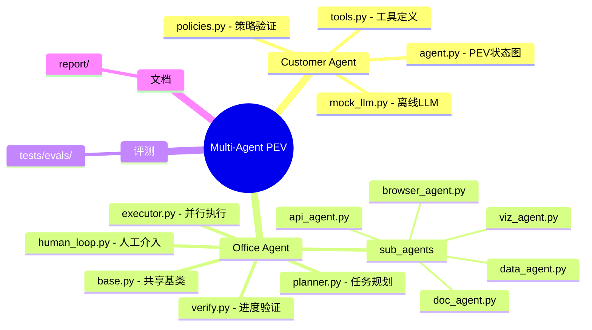

---

## 2. 架构设计

### 2.1 PEV 核心模式

PEV (Plan-Execute-Verify) 是一种**确定性较强**的 Agent 架构，将任务分解为三个阶段：

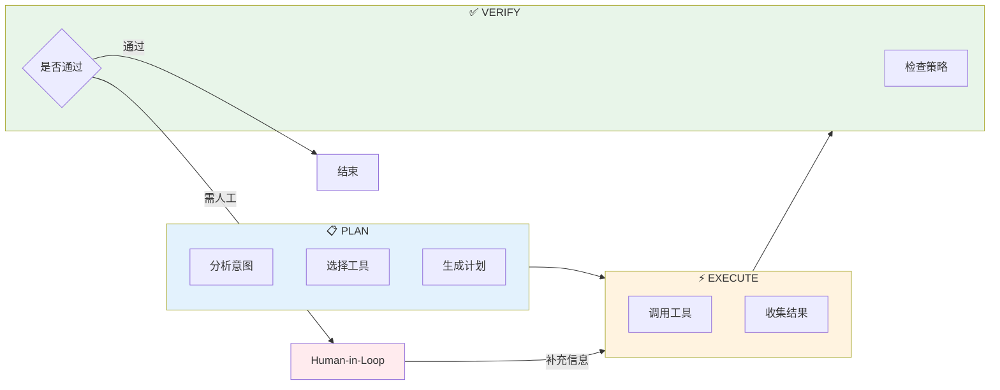

### 2.2 Human-in-the-Loop 机制

当自动流程无法完成时，引入人工介入：

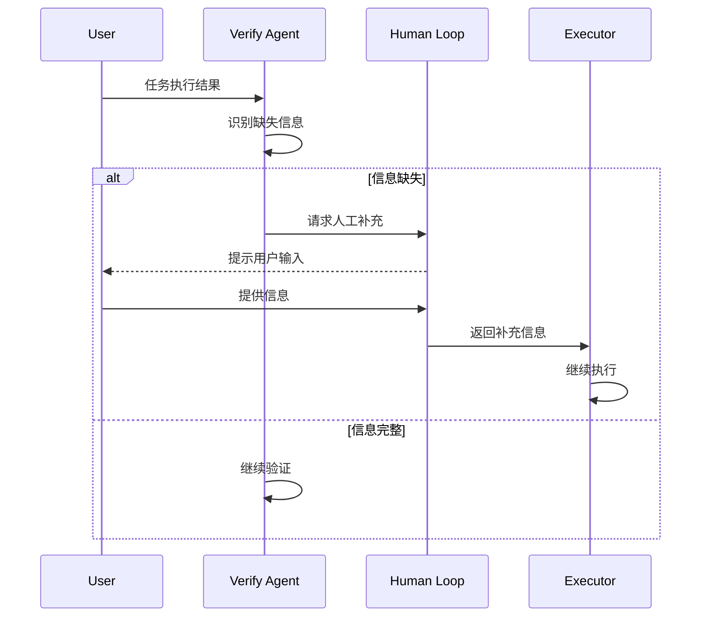

### 2.3 Office Agent 多 Agent 协作

Office Agent 采用 **Planner-Executor-Verify** 架构，支持并行任务执行：

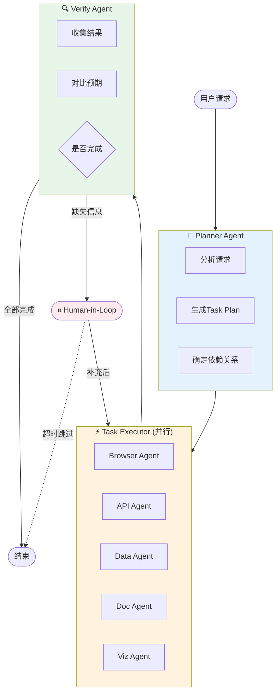

### 2.4 数据流设计

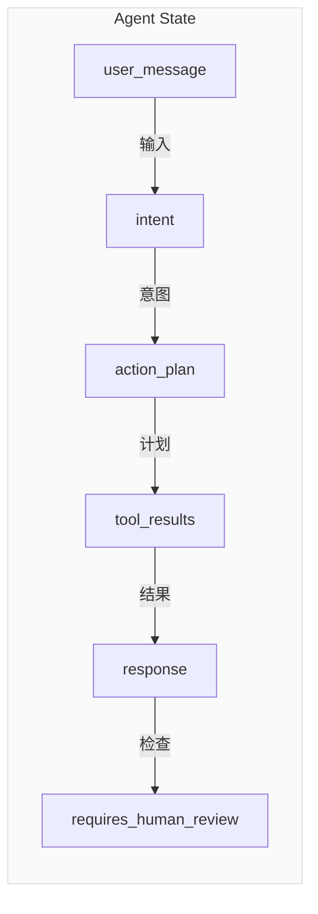

---

## 3. Customer Agent 实现

### 3.1 架构概述

Customer Agent 是**单 Agent PEV 模式**的典型实现，专注于客服场景：

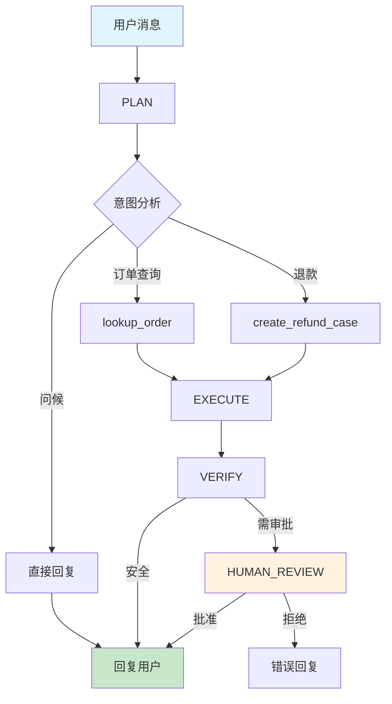

### 3.2 状态定义

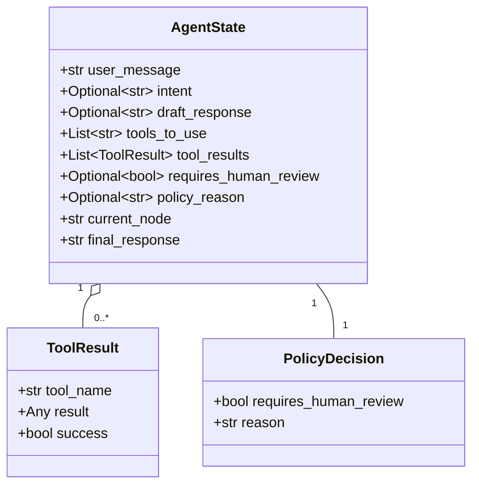

### 3.3 核心流程伪代码

```python
# 伪代码展示 PEV 流程

def customer_agent_pipeline(user_message):
    # PLAN: 分析意图，选择工具
    plan = plan_node(user_message)
    if plan.confidence < 0.5:
        return "抱歉，我没有理解您的问题"

    # EXECUTE: 调用工具
    results = execute_tools(plan.tools_to_use)

    # VERIFY: 检查策略
    policy = verify_policy(results)

    if policy.requires_human_review:
        # HUMAN_REVIEW: 等待人工审批
        approved = request_human_approval(results)
        if not approved:
            return "操作已被拒绝"
        return format_response(results)

    return format_response(results)
```

### 3.4 意图识别模式

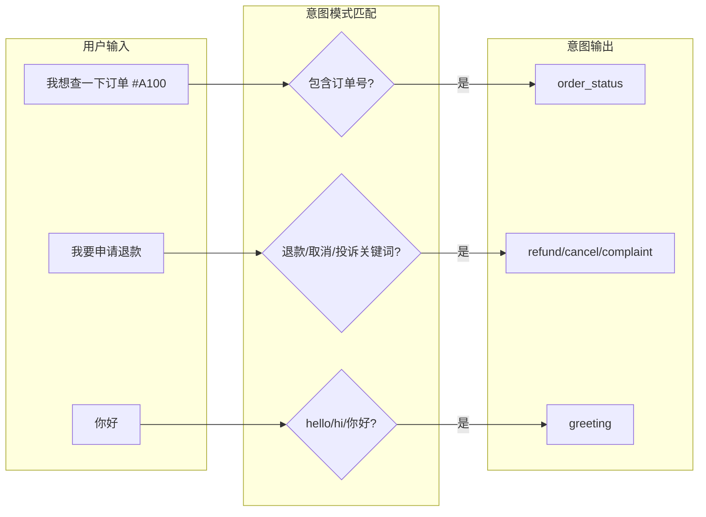

### 3.5 策略验证

```python
# 伪代码展示策略验证

class PolicyChecker:
    SENSITIVE_KEYWORDS = ["退款", "取消", "投诉"]

    def verify(self, intent, confidence, tool_results):
        # 1. 检查敏感词
        if contains_sensitive(intent):
            return PolicyDecision(requires_human=True, reason="涉及敏感操作")

        # 2. 检查置信度
        if confidence < 0.7:
            return PolicyDecision(requires_human=True, reason="置信度过低")

        # 3. 检查工具结果
        if tool_failed(tool_results):
            return PolicyDecision(requires_human=True, reason="工具执行失败")

        return PolicyDecision(requires_human=False, reason="通过验证")
```

---

## 4. Office Agent 实现

### 4.1 架构概述

Office Agent 是**多 Agent 协作模式**的实现，专注于复杂办公任务：

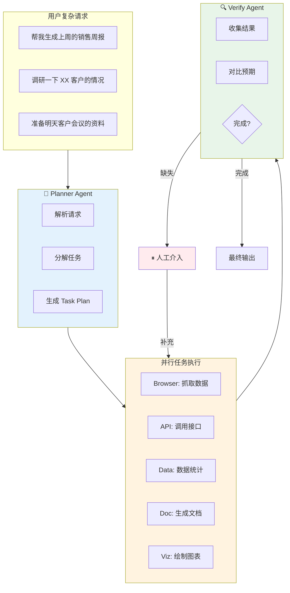

### 4.2 Task Plan 结构

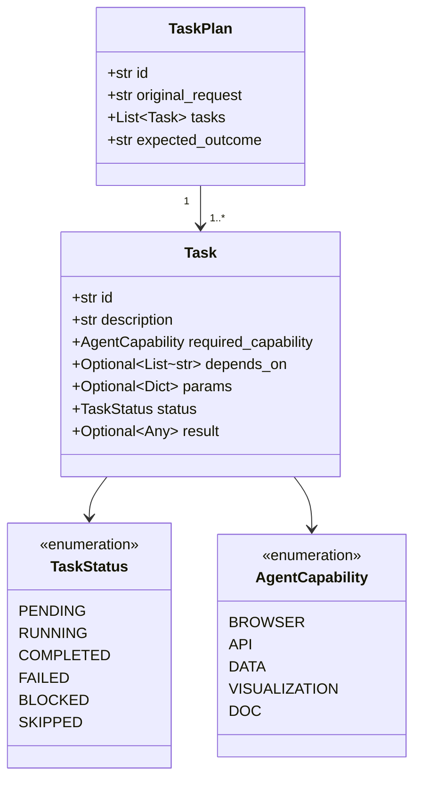

### 4.3 Planner Agent 工作流程

```python
# 伪代码展示 Planner 流程

class PlannerAgent:
    def plan(self, user_request):
        # 1. 高阶推理分析
        analysis = self.reasoning_model.analyze(user_request)

        # 2. 任务分解
        tasks = []
        for subtask in analysis.subtasks:
            task = Task(
                description=subtask.description,
                capability=subtask.required_capability,
                params=subtask.params,
                depends_on=subtask.dependencies
            )
            tasks.append(task)

        # 3. 生成预期结果
        expected = self.reasoning_model.predict_outcome(tasks)

        return TaskPlan(
            tasks=tasks,
            expected_outcome=expected
        )
```

### 4.4 Task Executor 并行执行

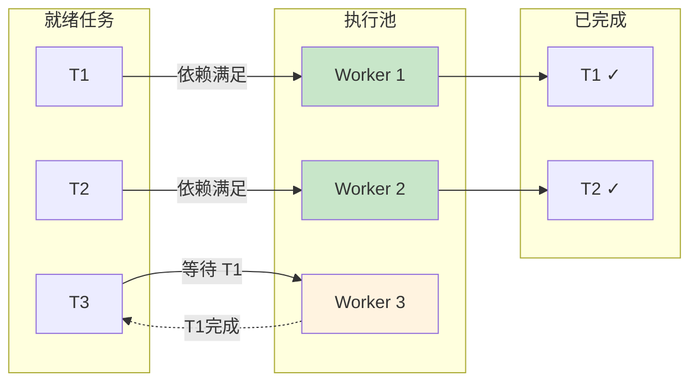

### 4.5 Verify Agent 验证逻辑

```python
# 伪代码展示 Verify 流程

class VerifyAgent:
    def verify(self, plan, results):
        # 1. 收集任务结果
        completed = {t.id: t for t in results if t.status == COMPLETED}

        # 2. 检查缺失任务
        missing = [t for t in plan.tasks if t.id not in completed]

        if not missing:
            # 3. 对比预期结果
            outcome_check = self.check_outcome(plan.expected_outcome, results)
            if outcome_check.passed:
                return VerificationResult(status=COMPLETED, missing_info=None)
            else:
                return VerificationResult(status=NEEDS_HUMAN, missing_info=outcome_check.gaps)

        # 4. 识别需要人工补充的信息
        gaps = self.identify_gaps(missing, results)
        return VerificationResult(status=NEEDS_HUMAN, missing_info=gaps)
```

### 4.6 办公场景示例

#### 场景 1: 周报生成

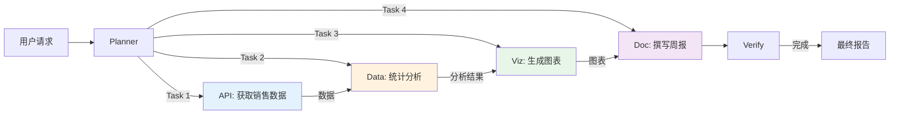

---

## 5. DeepEval 评测框架

### 5.1 评测指标设计

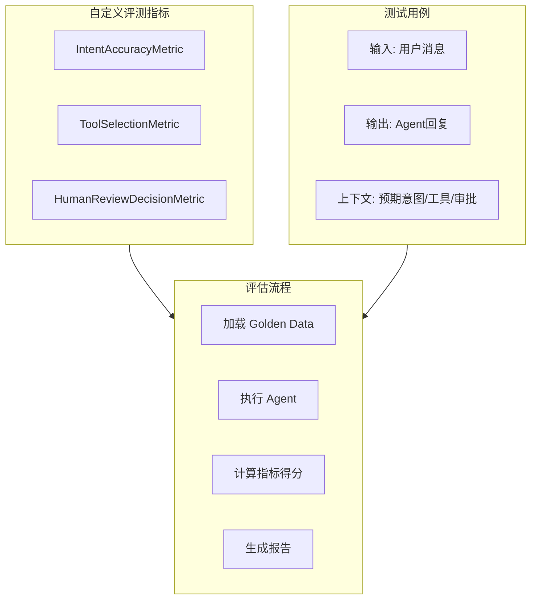

### 5.2 离线评测实现

```python
# 使用 DeepEval 自定义指标

from deepeval import assert_test
from deepeval.test_case import LLMTestCase
from deepeval.metrics import BaseMetric

class IntentAccuracyMetric(BaseMetric):
    """评估意图识别的准确性"""

    def _evaluate(self, test_case):
        expected_intent = test_case.context[0]
        actual_output = test_case.actual_output

        # 离线模式：基于关键词匹配
        if expected_intent in ["greeting", "thanks"]:
            score = 1.0 if any(kw in actual_output for kw in ["hello", "help", "thank"]) else 0.0
        else:
            score = 1.0 if "order" in actual_output.lower() else 0.0

        return score
```

### 5.3 评测命令

```bash
# 使用 deepeval 命令运行测试
deepeval test run tests/evals/test_customer_agent.py

# 或使用 pytest
pytest tests/evals/test_customer_agent.py -v
```

---

## 6. 运行与验证

### 6.1 Customer Agent 测试

```bash
# 运行单个场景
PYTHONPATH=src python3 examples/run_demo.py

# 运行 DeepEval 评测
deepeval test run tests/evals/test_customer_agent.py
```

### 6.2 Office Agent 测试

```bash
# 列出可用场景
PYTHONPATH=src python3 examples/run_office_agent.py --list

# 运行指定场景
PYTHONPATH=src python3 examples/run_office_agent.py --scenario=weekly_sales_report

# 运行所有场景
PYTHONPATH=src python3 examples/run_office_agent.py --all
```

### 6.3 测试结果

| Agent | 测试项 | 结果 |
|-------|--------|------|
| Customer Agent | 单元测试 | 7/7 通过 |
| Customer Agent | Golden Dataset | 10/10 通过 |
| Office Agent | Weekly Sales Report | 7 tasks ✓ |
| Office Agent | Customer Research | 6 tasks ✓ |
| Office Agent | Meeting Preparation | 3 tasks ✓ |

---

## 7. 后续可参考的设计模式

### 7.1 多 Agent 协作模式

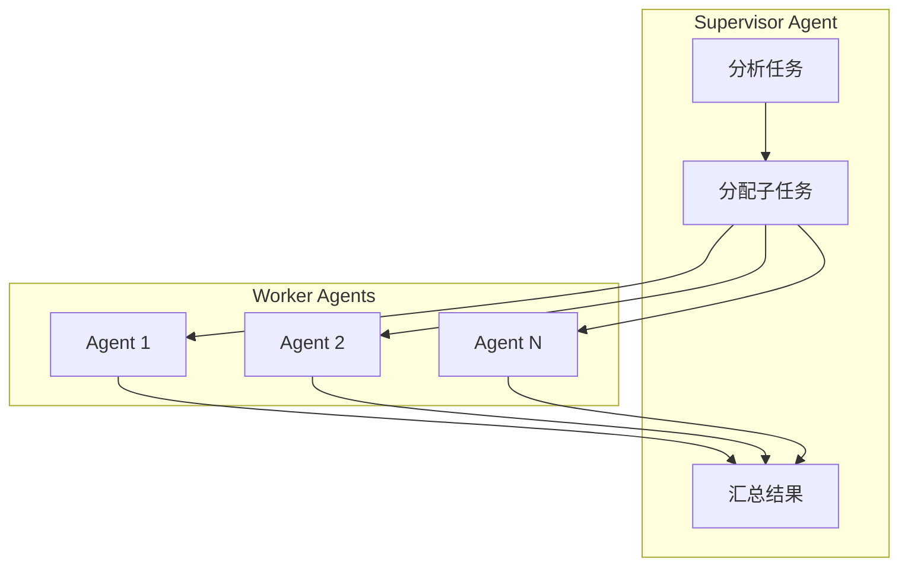

### 7.2 记忆增强模式

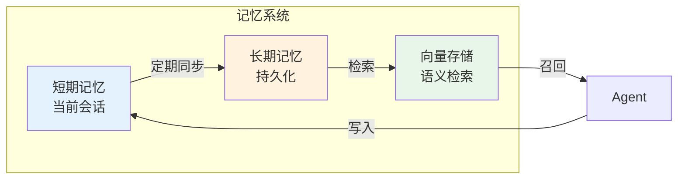

### 7.3 工具调用增强

| 模式 | 描述 | 适用场景 |
|------|------|----------|
| Tool Fusion | 组合多个工具调用 | 复杂查询 |
| Tool Retry | 失败自动重试 | 网络不稳定 |
| Tool Fallback | 主工具失败切换备选 | 降级处理 |
| Tool Planning | 工具调用序列规划 | 多步骤任务 |

### 7.4 扩展方向

| 方向 | 说明 |
|------|------|
| **RAG 集成** | 引入知识库检索增强回复 |
| **多模态** | 支持图像、文档等非文本输入 |
| **实时 LLM** | 替换 Mock 为真实模型（GPT-4、Claude 等） |
| **分布式执行** | 支持多 Agent 跨进程/跨机器协作 |
| **评测增强** | 引入 G-Eval 等基于模型的评测指标 |

---

## 附录

### A. 环境变量

| 变量 | 说明 | 默认值 |
|------|------|--------|
| `PYTHONPATH` | Python 模块搜索路径 | `src` |
| `DEEPEVAL_TELEMETRY_OPT_OUT` | 关闭 DeepEval 遥测 | `YES` |

### B. 依赖安装

```bash
pip install langchain langgraph deepeval pytest
```

### C. 版本信息

- DeepEval: 4.0.0
- LangChain: 最新兼容版本
- LangGraph: 最新兼容版本
